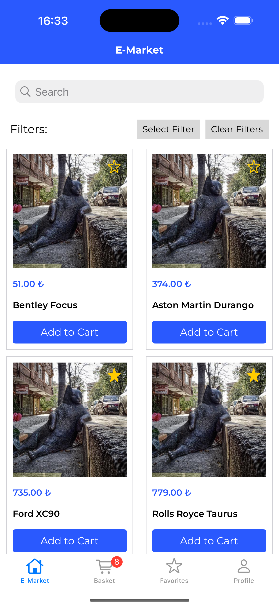
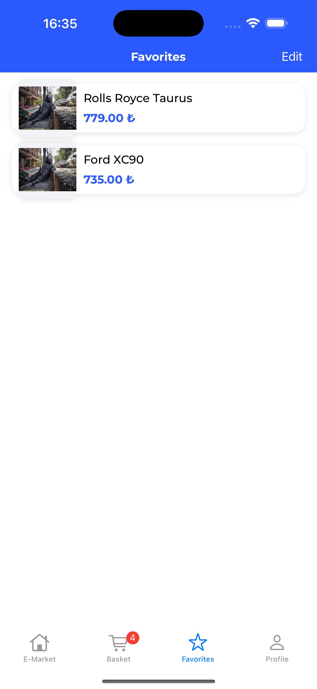
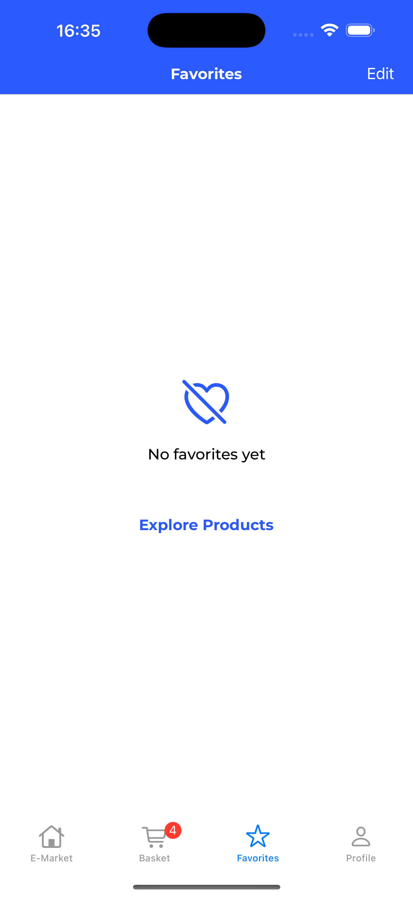
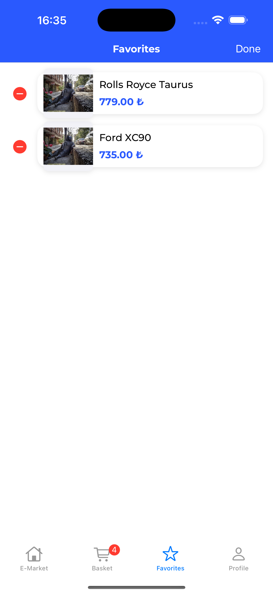
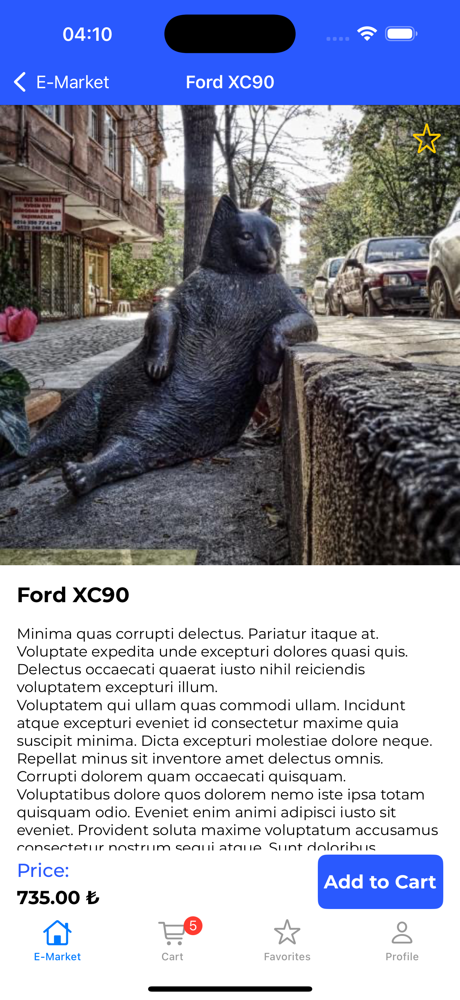
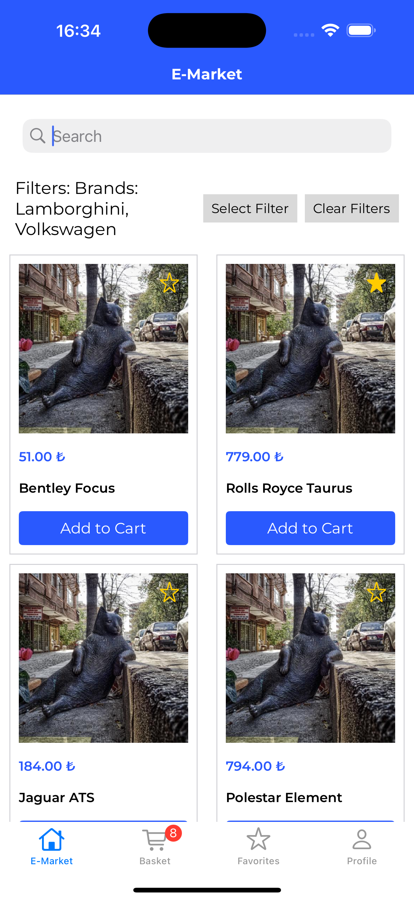
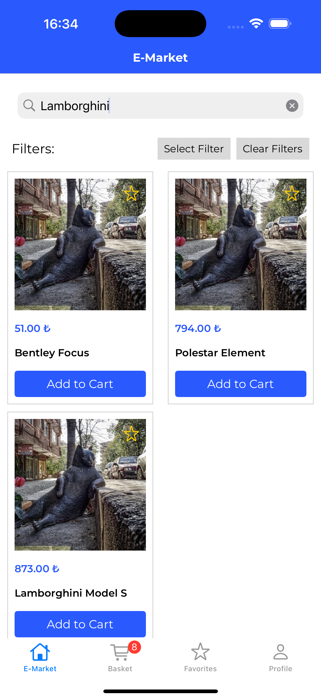
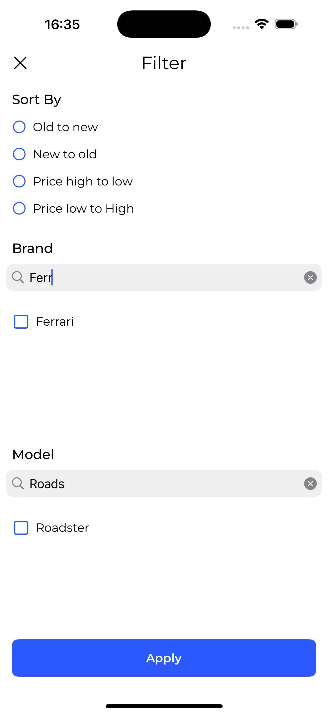
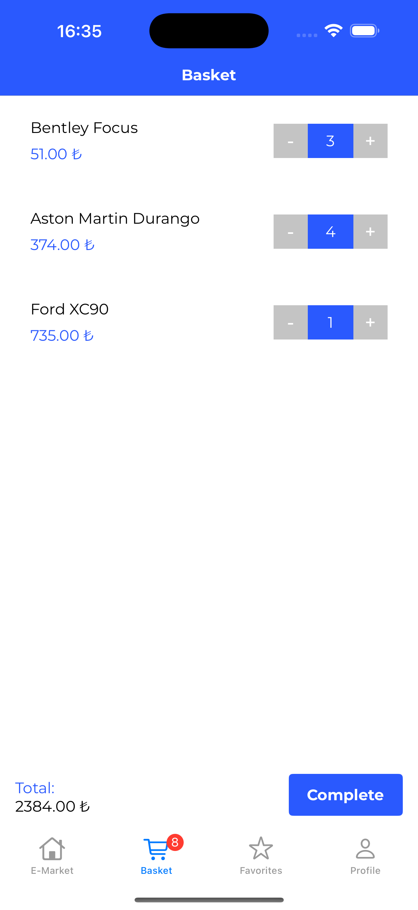
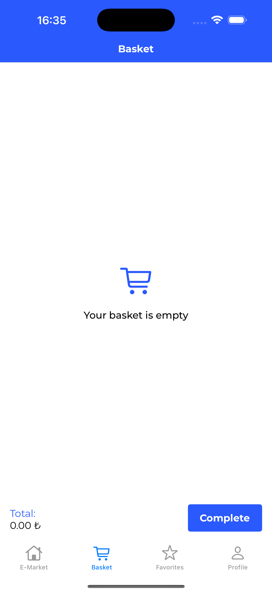

# Eteration Case
 
Bu proje, bir alışveriş uygulaması olup ürün listeleme, detay görüntüleme, arama, filtreleme ve favorilere ekleme gibi özellikleri içermektedir. Ayrıca, basket yönetimi ve sipariş tamamlama gibi özellikler de bulunmaktadır.

---
## 📸 Ekran Görüntüleri ve Videolar

| Görsel 1 | Görsel 2 | Görsel 3 |
|----------|----------|----------|
|  |  |  |
| **Ana Ekran** | **Favoriler Ekranı** | **Favoriler Boş Durum** |
|  |  |  |
| **Favoriler Düzenleme** | **Ürün Detay Ekranı** | **Filtrelenmiş Ürünler** |
|  |  |  |
| **Arama Sonuçları** | **Filtre ve Arama Sonuçları** | **Sepet** |
|  | | |
| **Boş Sepet** | | |

---

## 📂 Proje Mimarisi

### Kullanılan Mimari: **MVVM (Model-View-ViewModel)**  
Proje, MVVM mimarisi ile tasarlanmıştır. Bu mimari sayesinde, UI ve logic ayrılmıştır ve test edilebilirlik artırılmıştır.

### Katmanlar ve Sorumluluklar

1. **Model:**  
    - `ProductModel`: Ürün bilgilerini temsil eder.
    - `BasketModel`: Sepet verilerini içerir.

2. **ViewModel:**  
    - `HomeViewModel`: Ana ekranın iş mantığını yönetir.
    - `FavoritesViewModel`: Favoriler ekranını yönetir.
    - `BasketViewModel`: Sepet ekranının iş mantığını içerir.

3. **View (Controller):**  
    - `HomeViewController`: Ürün listeleme ve arama.
    - `ProductDetailViewController`: Ürün detaylarının görüntülenmesi.
    - `FavoritesViewController`: Favorilere eklenen ürünlerin listelenmesi.
    - `BasketViewController`: Sepet işlemlerinin yönetimi.

---

## 🔧 Teknolojiler ve Kütüphaneler

- **Swift 5**
- **XCTest**: Unit testler
- **UIKit**: UI tasarımı
- **CoreData**: Yerel veri saklama
- **Auto Layout**: Constraints, programmatic UI
---

## ✅ Gereksinimler ve Sağlanan Özellikler
- [x] Ürünleri listeleyebilme.
- [x] Ürün detaylarını görüntüleyebilme
- [x] Ürünleri favorilere ekleyebilme ve çıkarabilme (Core Data)
- [x] Ürünleri sepete ekleyebilme ve yönetebilme  (Core Data)
- [x] Ürünler arasında arama yapabilme
- [x] Ürünleri marka ve modele göre filtreleyebilme
- [x] Siparişi tamamlama
- [x] Pagination
- [x] Generic Network Katmanı
- [x] No data caselerin handle edilmesi
- [x] Loading caselerin handle edilmesi
- [x] Sepetteki eleman sayısının badge ile gösterimi
- [x] Tema ve Font manager ile UI yönetimi
- [x] Notification Center kullanımı

## 📜 Proje Kurulumu
Projeyi klonlayın ve ana dizinden çalıştırın:
   ```bash
   git clone https://github.com/ahmetbugraozcan/EterationCase.git
   cd EterationCase
